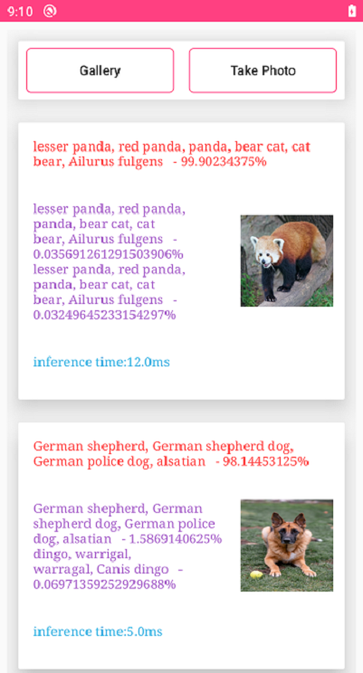

Inference demo
==============================

The Inference demo describes the app integration process using the SqueezeNet under Caffe as an example.

Introduction
------------

- The app integration process includes model pre-processing, model loading, model inference, and model post-processing.

Getting started
------------

- [Integration Guide] (https://developer.huawei.com/consumer/en/doc/2020104)

## Process Description

- Model pre-processing

  Major steps:

  1. Obtains the HiAI DDK version to determine whether the NPU is supported.

  2. Determines whether an offline model can run on the current HiAI version.

  3. If the offline model is incompatible with the HiAI DDK, try version compatibility by using the mixed-model online building API.

- Model loading

  Before using a model, you need to load the model. The DDK supports both single-model and multi-model loading.

  In sync mode, the app layer loads the model by calling the loadModelSync function at the JNI layer. In async mode, the app layer loads the model by calling the loadModelAsync function at the JNI layer.

- Model inference

  After the model is loaded, you can execute model inference.

  In sync mode, the app layer starts model inference by calling the runModelSync function at the JNI layer. In async mode, the app layer starts model inference by calling the runModelAsync function at the JNI layer.

- Model post-processing

  After inference, the model inference result is returned to the app layer.

  In sync mode, the app layer obtains the inference result by calling the runModelSync function and implements model post-processing by calling the postProcess function. In async mode, the app layer obtains the inference result by calling the OnProcessDone function and implements model post-processing by calling the postProcess function. 

- Reference source code

  Demo_Soure_Code\app\src\main\java\com\huawei\hiaidemo\utils\ModelManager.java

  Demo_Soure_Code\app\src\main\jni\*

  Demo_Soure_Code\app\src\main\java\com\huawei\hiaidemo\view\*

Result
-----------

License
-------

Copyright 2020 Huawei.

Licensed to the Apache Software Foundation (ASF) under one or more contributor
license agreements.  See the NOTICE file distributed with this work for
additional information regarding copyright ownership.  The ASF licenses this
file to you under the Apache License, Version 2.0 (the "License"); you may not
use this file except in compliance with the License.  You may obtain a copy of
the License at

  http://www.apache.org/licenses/LICENSE-2.0

Unless required by applicable law or agreed to in writing, software
distributed under the License is distributed on an "AS IS" BASIS, WITHOUT
WARRANTIES OR CONDITIONS OF ANY KIND, either express or implied.  See the
License for the specific language governing permissions and limitations under
the License.
